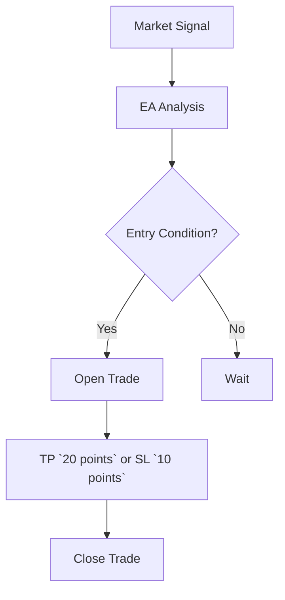

## Overview

FXZIG specializes in Forex trading solutions, delivering profitable expert advisors (EAs) that run on live accounts. You benefit from high-expectancy trades targeting up to `20 points` per trade. The company provides ready-to-run portfolios with automated trading robots, enabling you to implement strategies without manual intervention.

FXZIG's mission focuses on reliable automation for retail traders. You gain access to battle-tested systems optimized for major pairs like EUR/USD and GBP/USD.

<Callout kind="info">
  FXZIG EAs operate 24/5 on MetaTrader 4 and 5 platforms.
</Callout>

## Key Benefits

Automated Forex trading from FXZIG offers distinct advantages.

<Columns cols={3}>
  <Card title="High Expectancy" icon="trending-up" href="#">
    Achieve up to `20 points` per trade with proven strategies.
  </Card>
  <Card title="Live Account Ready" icon="play-circle" href="#">
    Deploy directly on live brokers without backtesting hassles.
  </Card>
  <Card title="Diversified Portfolios" icon="layers" href="#">
    Combine multiple EAs for balanced risk exposure.
  </Card>
</Columns>

## Expert Advisors and Portfolios

Expert advisors are algorithmic scripts executing trades based on technical indicators. FXZIG portfolios bundle several EAs, such as scalpers and trend followers.

Set up an EA using this configuration example:

<CodeGroup tabs="MT4,MQL5">
  ```mql4
  // FXZIG Scalper EA Config
  input double LotSize = 0.01;
  input int TakeProfit = 20;  // Points
  input int StopLoss = 10;
  input string MagicNumber = "FXZIG123";

  void OnTick() {
    if (OrdersTotal() == 0) {
      OrderSend(Symbol(), OP_BUY, LotSize, Ask, 3, Ask - StopLoss * Point, Ask + TakeProfit * Point, "FXZIG Buy", MagicNumber);
    }
  }
  ```
  ```mql5
  // FXZIG Scalper EA Config (MT5)
  input double LotSize = 0.01;
  input int TakeProfit = 20;
  input int StopLoss = 10;
  input string MagicNumber = "FXZIG123";

  void OnTick() {
    if (PositionsTotal() == 0) {
      MqlTradeRequest request = {};
      request.action = TRADE_ACTION_DEAL;
      request.symbol = Symbol();
      request.volume = LotSize;
      request.type = ORDER_TYPE_BUY;
      request.price = SymbolInfoDouble(Symbol(), SYMBOL_ASK);
      request.sl = request.price - StopLoss * Point();
      request.tp = request.price + TakeProfit * Point();
      request.magic = StringToInteger(MagicNumber);
      MqlTradeResult result = {};
      OrderSend(request, result);
    }
  }
  ```
</CodeGroup>

## Portfolio Options

Choose from FXZIG's ready-to-run portfolios tailored to your risk profile.

<Tabs>
  <Tab title="Conservative" icon="shield">
    Low drawdown (`<5%`), focuses on major pairs.

    | Pair     | EA Type    | Expectancy |
    |----------|------------|------------|
    | EUR/USD  | Trend     | `15 points`|
    | USD/JPY  | Scalper   | `10 points`|

  </Tab>
  <Tab title="Aggressive" icon="zap">
    Higher returns (`>20 points`), includes exotics.

    | Pair       | EA Type    | Expectancy |
    |------------|------------|------------|
    | GBP/USD   | Breakout  | `25 points`|
    | AUD/USD   | Grid      | `18 points`|

  </Tab>
</Tabs>

## Getting Started

Follow these steps to deploy FXZIG solutions.

<Steps>
  <Step title="Download Portfolio" icon="download">
    Access your FXZIG account and download the `.ex4` or `.ex5` files.
  </Step>
  <Step title="Install on MT4/MT5" icon="package">
    Copy EAs to `MQL4/Experts` or `MQL5/Experts` folder. Restart terminal.
  </Step>
  <Step title="Attach to Chart" icon="monitor">
    Drag EA to chart, enable `Allow live trading`, set `YOUR_BROKER_ACCOUNT`.
  </Step>
  <Step title="Monitor Performance" icon="bar-chart">
    Review trades in `Trade` tab. Adjust lots based on equity.
  </Step>
</Steps>

## Performance and Risk Considerations

Expectancy measures average profit per trade. FXZIG targets `15-20 points` after spreads.



<Callout kind="danger">
  Forex trading involves risk of loss. Past performance does not guarantee future results. Use risk capital only.
</Callout>

<Expandable title="Advanced Risk Metrics" default-open="false">
  Sharpe ratio: `>1.5`. Maximum drawdown: `<10%` on portfolios. Monthly returns: `5-15%`.
</Expandable>

Monitor via journal exports:

```mql4
// Export trade log
FileWrite(logFile, "Trade: " + DoubleToStr(Profit, 2) + " points");
```